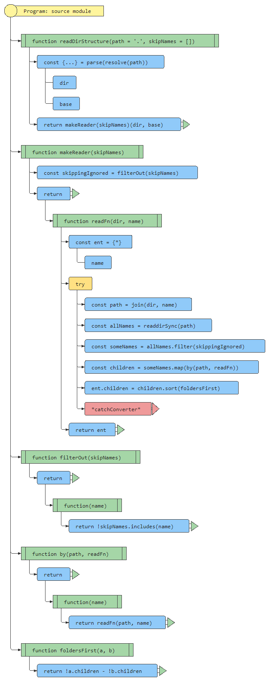

# Folder Structure Markup


<hr>
  
1. ### [Introduction](#-introduction)
    - [Tree Object Format](#-tree-object-format) 
2. ### [Setup](#-setup)
3. ### [Usage Examples](#-usage-examples)
    - [`readDirStructure()`](#-readdirstructurepath-ignorenames)
    - [`makeDirStructure()`](#-makedirstructuretree-path)
    - [`stringifyDirStructure()`](#-stringifydirstructuretree)
4. ### [Implementation Details](#-implementation-details)
    - [`readDirStructure() {...}`](#-readdirstructurepath-ignorenames-1)
    - [`makeDirStructure() {...}`](#-makedirstructuretree-path-1)
    - [`stringifyDirStructure() {...}`](#-stringifydirstructuretree-1)
  
<hr>

## [🔝](#--introduction) Introduction

This repo includes three functions to work with and present the folder structure of a project. The functions are:

- ### `readDirStructure()`
  Reads the folder structure at given path and returns a tree object describing the folders and files therein.

- ### `makeDirStructure()`
  Creates a folder structure with initially empty files at specified path based on a given tree object describing the folders and files therein.

- ### `stringifyDirStructure()`
  Presents the given folder structure in a human readable format. The markup generated by this function can be used in a documentation with monospace font to display the folder structure.

## [🔝](#--introduction) Tree Object Format

To describe a folder structure, a tree object is used. The tree object is a nested object like this:

```js
tree = { name: 'folder', children: [
  { name: 'subfolder1', children: [
    { name: 'subfolder2', children: [] },
    { name: 'subfolder3', children: [
      { name: 'file1.ext' },
      { name: 'file2.ext' },
    ] },
  ] },
  { name: 'file3.ext' },
] }
```

where each node has a `name` property. If the node is representing a folder, it also has a `children` property which is an array of similar nodes with an arbitrary depth of nesting. Of course, any other kind of data structure could be used to describe a folder structure, but all functions in this repo expect the tree object to be in this format.

## [🔝](#--introduction) Setup

Copy the functions you need from `structure.js` into your project. Then you can use them separately or in combination. For example, you can read a folder structure from a path and then present it in a human readable format or you can create a folder structure at a path based on a tree object describing the structure.

`readDirStructure()` and `makeDirStructure()` do require Node.js builtin modules `fs` and `path`, so make sure to import those in your project. `stringifyDirStructure()` does not require any additional modules so it can run in a browser too.

## [🔝](#--introduction) Usage Examples

### [🔝](#--introduction) `readDirStructure(?path, ?ignoreNames)`

Reads the folder structure at specified path and returns a tree object describing the folders and files therein. No side effects.

```js
const path = './folder' // optional, default is '.'
// or 'C:/folder'
// or 'C:\\folder\\subfolder'
// or '/home/username/folder'
// or './folder/subfolder'
// or '../../folder' etc.
const ignoreNames = ['.git', 'node_modules', '.DS_Store', '.vscode', '.gitignore'] // optional, default is []
const tree = readDirStructure(path, ignoreNames)
console.log(tree)
``` 

That will output a structure like in the [example](#tree-object-format) above.

### [🔝](#--introduction) `makeDirStructure(tree, ?path)`

Creates a folder structure with initially empty files at specified path based on a tree object describing the folders and files therein. No return value.

```js
const tree = { name: 'folder', children: [
  { name: 'subfolder1', children: [
    { name: 'subfolder2', children: [] },
    { name: 'subfolder3', children: [
      { name: 'file1' },
      { name: 'file2' },
    ] },
  ] },
  { name: 'file3' },
] }
const path = './folder' // optional, default is '.'
// or 'C:\\folder' etc.
makeDirStructure(tree, path)
```
That will create a corresponding folder structure at the specified path, note that the `folder` directory will be created inside the existing `folder` directory, so you probably do not want to use the same name for the tree root node and the path or you will end up with a double nested folder.

Also, do not worry about existing files or folders, they will not be overwritten and no error will be thrown. The function will continue to create the folder structure and files as specified in the tree object simply skipping any existing files or folders as they are already there.

### [🔝](#--introduction) `stringifyDirStructure(tree)`

Presents the given folder structure in a human readable format. The markup generated by this function can be used in a documentation with monospace font to display the folder structure. No side effects.

```js
const tree = { name: 'folder', children: [
  { name: 'subfolder1', children: [
    { name: 'subfolder2', children: [] },
    { name: 'subfolder3', children: [
      { name: 'file1.ext' },
      { name: 'file2.ext' },
    ] },
  ] },
  { name: 'file3.ext' },
] }
const markup = stringifyDirStructure(tree)
console.log(markup)
```
That will output a markup like this:

```
  └─📁folder
     ├─📁subfolder1
     │  ├─📁subfolder2
     │  └─📁subfolder3
     │     ├─📄file1.ext
     │     └─📄file2.ext
     └─📄file3.ext
```
And it can be used in a documentation with monospace font to display the folder structure. Note that lines appear solid with lower line height or dashed with higher line height.

## [🔝](#--introduction) Implementation Details

### [🔝](#--introduction) `readDirStructure() `Implementation

```js
const { readdirSync } = require('fs')
const { resolve, parse, join } = require('path')

function readDirStructure(path = '.', skipNames = []) {
  const { dir, base } = parse(resolve(path))

  return makeReader(skipNames)(dir, base)
}

function makeReader(skipNames) {
  const skippingIgnored = filterOut(skipNames)

  return function readFn(dir, name) {
    const ent = { name }

    try {
      const path = join(dir, name)
      const allNames = readdirSync(path)
      const someNames = allNames.filter(skippingIgnored)
      const children = someNames.map(by(path, readFn))

      ent.children = children.sort(foldersFirst)
    } catch { }

    return ent
  }
}

function filterOut(skipNames) {
  return function (name) {
    return !skipNames.includes(name)
  }
}

function by(path, readFn) {
  return function (name) {
    return readFn(path, name)
  }
}

function foldersFirst(a, b) {
  return !a.children - !b.children
}
```


